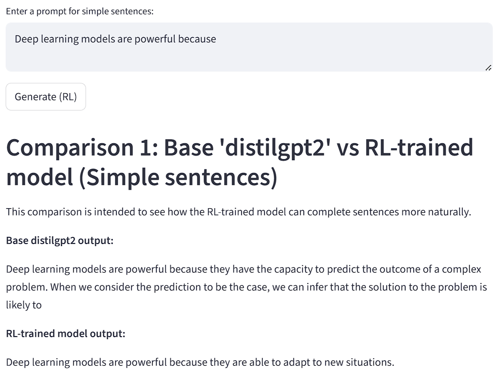
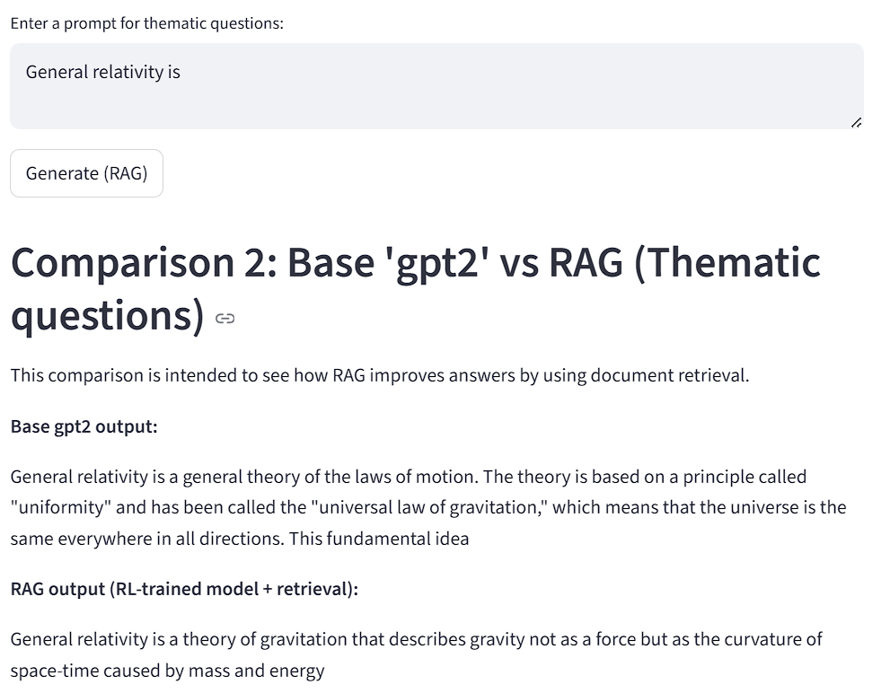

# LLM - Fine-tuning y RL para Modelos de Lenguaje

Este proyecto explora el entrenamiento por refuerzo (RL) de modelos de lenguaje tipo GPT-2, así como la integración de técnicas de Retrieval-Augmented Generation (RAG) para mejorar respuestas temáticas. Incluye scripts para entrenamiento, inferencia y una app interactiva con Streamlit.

## Estructura del Proyecto

```
LLM/
├── app.py                # Interfaz Streamlit para comparación de modelos
├── environment.yaml      # Entorno Conda con dependencias
├── src/
│   ├── config.py         # Configuración de rutas y parámetros
│   ├── dataset.py        # Utilidades para datasets
│   ├── generate.py       # Inferencia con modelos base o RL
│   ├── inference.py      # Comparación de outputs (base vs RL)
│   ├── reward.py         # Función de reward para PPO
│   ├── rl_train.py       # Entrenamiento RL (PPO)
│   ├── ingest.py         # Carga documentos, los divide en fragmentos, genera embeddings y crea un índice FAISS para búsquedas semánticas
    ├── rag.py            # Retrieval-Augmented Generation (RAG)
├── docs/
│   ├── black_holes.txt         
    ├── general_relativity.txt 
    ├── space_time.txt       
└── README.md
```

## Instalación

1. **Clona el repositorio** y entra a la carpeta:

   ```bash
   git clone https://github.com/ikerarandia99/LLM.git
   cd LLM
   ```

2. **Crea el entorno Conda**:

   ```bash
   conda env create -f environment.yaml
   conda activate LLM
   ```

## Entrenamiento

### Entrenamiento por Refuerzo (RL, PPO)

Entrena un modelo GPT-2 con PPO usando `src/rl_train.py` para que aprenda a generar outputs que finalicen la frase correctamente:

```bash
python src/rl_train.py
```

- El reward se define en `src/reward.py` y favorece frases bien formadas, sin repeticiones ni finales anómalos.
- El modelo entrenado se guarda en `models/gpt2-rl/final/`.

## Inferencia

### Usar el modelo base o RL

Puedes generar texto con:

- `src/generate.py`: para el modelo base o cualquier modelo HuggingFace.
- `src/inference.py`: compara outputs entre el modelo base y el modelo RL.

Ejemplo:

```bash
python src/generate.py
```

## Retrieval-Augmented Generation (RAG)

El script `src/rag.py` permite responder preguntas usando recuperación de documentos y generación con el modelo RL o base. Requiere un índice FAISS y embeddings (ver función `load_vectorstore`), que se genera usando el script `src/ingest.py`. 

## App Interactiva (Streamlit)

Lanza la app para comparar modelos y probar prompts:

```bash
streamlit run app.py
```

- Permite comparar el modelo base (`distilgpt2` o `gpt2`) vs el modelo RL.
- Incluye comparación con RAG para preguntas temáticas (requiere índice FAISS y dependencias de LangChain).

## Configuración

Edita `src/config.py` para ajustar rutas, modelo base y parámetros de entrenamiento.

## Notas

- Los modelos y checkpoints se guardan en `models/gpt2-rl/`.
- Los datos de entrenamiento deben colocarse en la carpeta `data/`.
- El reward para RL está diseñado para premiar frases naturales y penalizar repeticiones o finales incorrectos.

## Ejemplos de mejora con PPO y RAG

### 1. Mejora con PPO (Fine-tuning por refuerzo)
El siguiente ejemplo muestra la diferencia entre un modelo base (GPT-2) y el modelo entrenado con PPO.  
  
*Descripción:* El modelo PPO produce respuestas más coherentes y completas, evitando repeticiones y finales abruptos.

---

### 2. Mejora con RAG (Retrieval-Augmented Generation)
El siguiente ejemplo muestra cómo RAG utiliza recuperación de documentos para enriquecer las respuestas del modelo.  
  
*Descripción:* RAG incorpora contexto relevante de documentos externos, mejorando precisión y detalle en las respuestas.

---